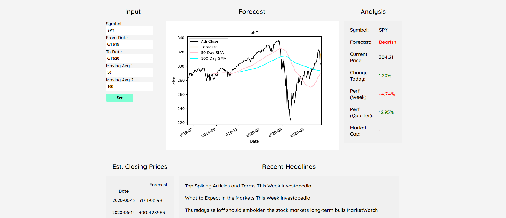
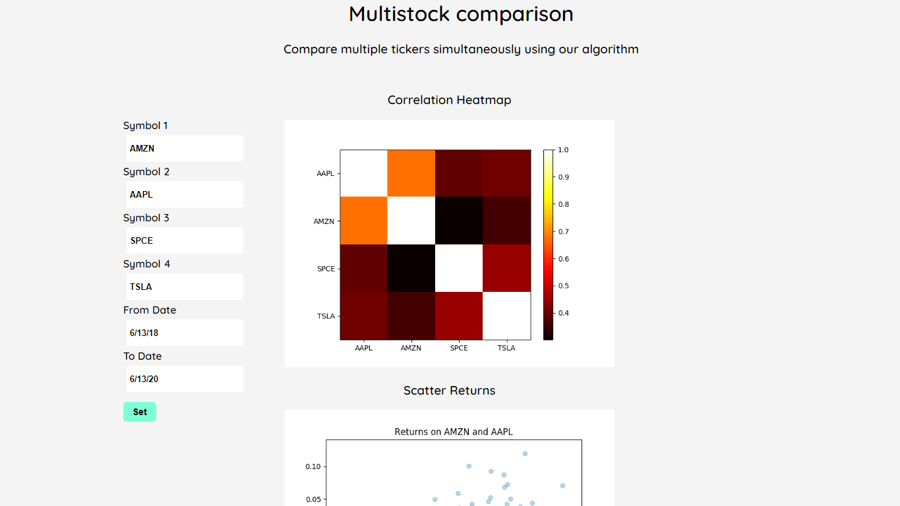
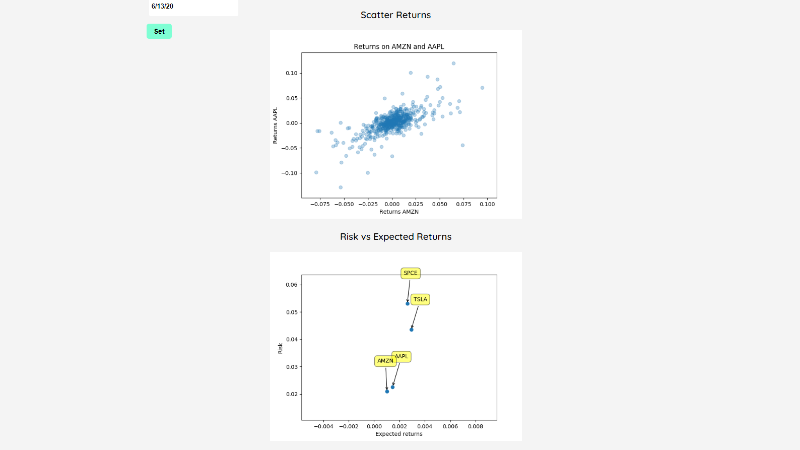

# Machine Learning Stock Forecasting Web App

## About
This project makes use of machine learning algorithms and technical indicators to perform financial analysis on any stock. The app is built on several technologies including Python, Flask, Pandas, and Matplotlib. This project is for experimental purposes with data ETL and machine learning. This algorithm is far from perfect and shouldn't be used
to base trades on.

## Data Pipeline
The symbol you input is passed through to Yahoo Finance API. The app then web scrapes financial data in real time about that stock. The historical price data is fed into the machine learning algorithm (KNN) and a forecast and/or analysis is made. A prediction is plotted and everything is output back to the UI.

## Usage

### Forecasting

Preidction page\
https://ml-fintech.herokuapp.com/prediction/
- Enter a ticker
- Start date of data you want to feed
- Last date (cannot be in the future! Use todays date)
- Try to use around a 2-3 year time frame for best results
- \# Day moving averages you would like to see 50/100 is good
- The analysis tab will give you real-time data
- The the alogrithm's estimated closing prices will show below
- Latest headlines on the stock will show as well

### Multistock comparison
Stock Comparison Page\
https://ml-fintech.herokuapp.com/multi
- Enter a ticker and date range
- The heatmap displays possible correlation between stocks
- Scatter plot displays expected returns between stocks
- The third plot is expected risk vs return on stocks

#### Enjoy!

